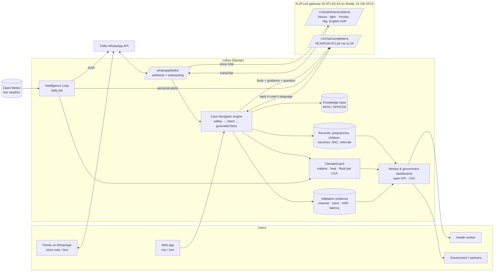
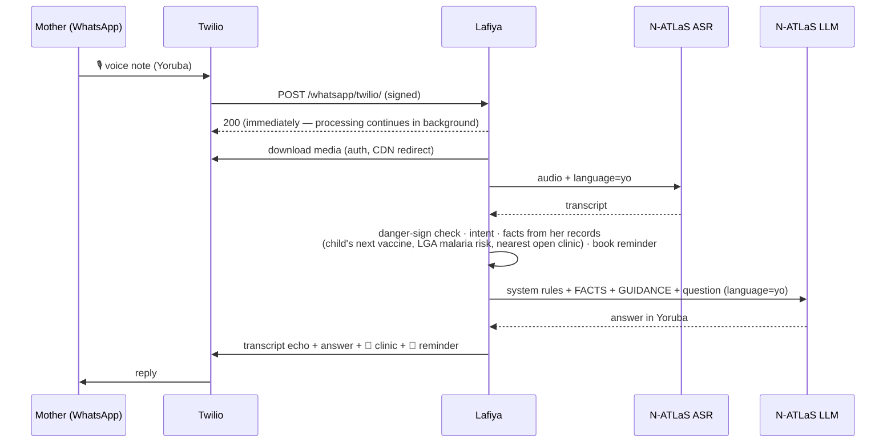

# Lafiya AI — Architecture

Lafiya is a voice-first community health service. Families ask questions by **WhatsApp voice note** or in the web app,
in Hausa, Yoruba, Igbo, Pidgin or English. **N-ATLaS** transcribes the voice note (official NCAIR ASR models) and writes
the answer in the person's language, grounded in their own records and WHO/NPHCDA guidance.

## System overview

## The Intelligence Loop

| Step | What happens | Code |
|---|---|---|
| **1. Sense** | 21 days of observed + 7 days of forecast weather per LGA from Open-Meteo; risk scored for today and the same day last week (real trends) | `climateguard/weather.py`, `climateguard/risk.py` |
| **2. Match** | Risk matched to the people it affects: pregnant women and under-5 caregivers (malaria), plus people with hypertension/diabetes (heat), every household (flood). Vaccine and ANC reminders from each person's schedule | `alerts/engine.py` |
| **3. Speak** | N-ATLaS writes each alert in the person's language from structured facts; localized templates are the safety net | `navigator/natlas.py`, `alerts/messages.py` |
| **4. Act** | Nearest suitable (and open) facility attached; alert pushed on WhatsApp; Care Navigator books reminders and records referrals | `core/geo.py`, `navigator/whatsapp.py` |
| **5. See** | Health workers get due/overdue lists; government sees risk, coverage gaps and response on one dashboard and API | `dashboard/` |

## How a WhatsApp voice note is answered

## N-ATLaS integration points

| Where | Endpoint | Purpose |
|---|---|---|
| WhatsApp voice notes, web mic | `POST /v1/audio/transcriptions` (`file`, `language`) | Speech-to-text with the official NCAIR Hausa/Igbo/Yoruba/Nigerian-English ASR models. Pidgin → Nigerian-English model |
| Care Navigator replies | `POST /v1/chat/completions` (`model=NCAIR1/N-ATLaS`, `language`) | Grounded answer in the user's language, ≤5 sentences, ends with a next step |
| Intelligence Loop alerts | same | Personal alert text per person / LGA / language |
| `natlas_check` command | `GET /health` + chat + ASR | Connection test and warm-up before demos |

Grounding prompt (`navigator/natlas.py`): the model receives only **facts from the person's records** and **curated
guidance**, and is instructed to reply in the user's language, never diagnose, and refer danger signs.

## Safety and reliability design

- **Safety does not depend on the model.** Danger signs (bleeding, convulsions, breathing difficulty… in five
  languages) are detected deterministically; the emergency referral and "call 112" are always prepended.
- **Educate and refer, never diagnose** — enforced in the prompt and in the template engine.
- **Graceful degradation.** If the GPU is cold-starting or unreachable, replies fall back to localized templates built
  from the same facts; every reply records whether N-ATLaS or a template produced it.
- **Explainable risk.** Published thresholds; each risk score and alert carries a plain-language reason.
- **Data protection (NDPA 2023).** Consent before any storage (web, CHW enrolment, WhatsApp onboarding); STOP on
  WhatsApp or "Delete my data" on the web erases everything; dashboards aggregate; the open API and CSV suppress small
  counts; evidence export pseudonymises users.

## Components

| App | Responsibility |
|---|---|
| `core` | States, LGAs, wards, facilities, profiles, children; facility finder; consent, export & erasure |
| `mamacare` | Pregnancy, WHO 8-contact ANC schedule, danger signs, milestones |
| `immunitrack` | National routine schedule, due/overdue logic, coverage & zero-dose indicators |
| `climateguard` | Weather ingestion and malaria/heat/flood risk scoring |
| `alerts` | Personalised alerts and the Intelligence Loop |
| `navigator` | Care Navigator engine, N-ATLaS client, WhatsApp channel, referrals, conversations |
| `dashboard` | Health-worker and government dashboards, open API, CSV export, validation evidence |

Stack: Django 5.2 (no other Python dependencies), SQLite for the MVP (PostgreSQL for production), Bootstrap, Leaflet,
Chart.js; N-ATLaS served by the N-ATLAS-Kit gateway (vLLM + Whisper ASR) on Modal; Twilio for WhatsApp; Open-Meteo for
weather.
